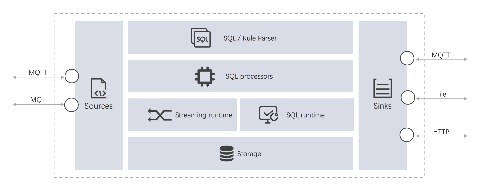

# EMQ X Kuiper - 超轻量物联网边缘数据分析软件

[English](README.md) | [简体中文](README-CN.md)

## 概览

EMQ X Kuiper 是 Golang 实现的轻量级物联网边缘分析、流式处理开源软件，可以运行在各类资源受限的边缘设备上。Kuiper 设计的一个主要目标就是将在云端运行的实时流式计算框架（比如 [Apache Spark](https://spark.apache.org)，[Apache Storm](https://storm.apache.org) 和 [Apache Flink](https://flink.apache.org) 等）迁移到边缘端。Kuiper 参考了上述云端流式处理项目的架构与实现，结合边缘流式数据处理的特点，采用了编写基于``源 (Source)``，``SQL (业务逻辑处理)``, ``目标 (Sink)`` 的规则引擎来实现边缘端的流式数据处理。



**应用场景**

Kuiper 可以运行在各类物联网的边缘使用场景中，比如工业物联网中对生产线数据进行实时处理；车联网中的车机对来自汽车总线数据的即时分析；智能城市场景中，对来自于各类城市设施数据的实时分析。通过 Kuiper 在边缘端的处理，可以提升系统响应速度，节省网络带宽费用和存储成本，以及提高系统安全性等。

## 功能

- 超轻量

  - 核心服务安装包约 4.5MB，初始运行时占用内存约 10MB

- 跨平台

  - 流行 CPU 架构：X86 AMD * 32, X86 AMD * 64; ARM * 32, ARM * 64位; PPC
  - 常见 Linux 发行版、OpenWrt 嵌入式系统、MacOS、Docker
  - 工控机、树莓派、工业网关、家庭网关、MEC 边缘云等

- 完整的数据分析

  - 通过 SQL 支持数据抽取、转换和过滤
  - 数据排序、分组、聚合、连接
  - 60+ 各类函数，覆盖数学运算、字符串处理、聚合运算和哈希运算等
  - 4 类时间窗口

- 高可扩展性

  提供插件扩展机制，可以支持在``源 (Source)``，``SQL 函数 ``, ``目标 (Sink)`` 三个方面的扩展

  - 源 (Source) ：内置支持 MQTT 数据的接入，提供了扩展点支持任意的类型的接入
  - 目标(Sink)：内置支持 MQTT、HTTP，提供扩展点支持任意数据目标的支持
  - SQL 函数：内置支持60+常见的函数，提供扩展点可以扩展自定义函数

- 管理能力

  - 命令行对流、规则进行管理
  - 通过 REST API 也可以流与规则进行管理（规划中）
  - 与 [KubeEdge](https://github.com/kubeedge/kubeedge)、[K3s](https://github.com/rancher/k3s) 等基于边缘 Kubernetes 框架的集成能力

- 与 EMQ X Edge 集成

  提供了与 EMQ X Edge 的无缝集成，实现在边缘端从消息接入到数据分析端到端的场景实现能力

## 快速入门

1. 从 ``https://hub.docker.com/r/emqx/kuiper/tags`` 拉一个 Kuiper 的 docker 镜像。

2. 设置 Kuiper 源为一个 MQTT 服务器。本例使用位于 ``tcp://broker.emqx.io:1883`` 的 MQTT 服务器， ``broker.emqx.io`` 是一个由 [EMQ](https://www.emqx.io) 提供的公有MQTT 服务器。

   ```shell
   docker run -d --name kuiper -e MQTT_BROKER_ADDRESS=tcp://broker.emqx.io:1883 emqx/kuiper:$tag
   ```

3. 创建流（stream）- 流式数据的结构定义，类似于数据库中的表格类型定义。比如说要发送温度与湿度的数据到 ``broker.emqx.io``，这些数据将会被在**本地运行的** Kuiper docker 实例中处理。以下的步骤将创建一个名字为 ``demo``的流，并且数据将会被发送至 ``devices/device_001/messages`` 主题，这里的 ``device_001`` 可以是别的设备，比如 ``device_002``，所有的这些数据会被 ``demo`` 流订阅并处理。

   ```shell
   -- In host
   # docker exec -it kuiper /bin/sh
   
   -- In docker instance
   # bin/cli create stream demo '(temperature float, humidity bigint) WITH (FORMAT="JSON", DATASOURCE="devices/+/messages")'
   Connecting to 127.0.0.1:20498...
   Stream demo is created.
   
   # bin/cli query
   Connecting to 127.0.0.1:20498...
   kuiper > select * from demo where temperature > 30;
   Query was submit successfully.
   
   ```

4. 您可以使用任何[ MQTT 客户端工具](https://www.emqx.io/cn/blog/mqtt-client-tools)来发布传感器数据到服务器 ``tcp://broker.emqx.io:1883``的主题 ``devices/device_001/messages`` 。以下例子使用 ``mosquitto_pub``。

   ```shell
   # mosquitto_pub -h broker.emqx.io -m '{"temperature": 40, "humidity" : 20}' -t devices/device_001/messages
   ```

5. 如果一切顺利的话，您可以看到消息打印在容器的 ``bin/cli query`` 窗口里，请试着发布另外一条``温度``小于30的数据，该数据将会被 SQL 规则过滤掉。

   ```shell
   kuiper > select * from demo WHERE temperature > 30;
   [{"temperature": 40, "humidity" : 20}]
   ```

   如有任何问题，请查看日志文件 ``log/stream.log``。

6. 如果想停止测试，在``bin/cli query``命令行窗口中敲 ``ctrl + c `` ，或者输入 ``exit`` 后回车

7. 想了解更多 EMQ X Kuiper 的功能？请参考以下关于在边缘端使用 EMQ X Kuiper 与 AWS / Azure IoT 云集成的案例。

   - [轻量级边缘计算 EMQ X Kuiper 与 AWS IoT 集成方案](https://www.jianshu.com/p/7c0218fd1ee2)
   - [轻量级边缘计算 EMQ X Kuiper 与 Azure IoT Hub 集成方案](https://www.jianshu.com/p/49b06751355f) 

## 性能测试结果

### 吞吐量测试支持

- 使用 JMeter MQTT 插件来发送数据到 EMQ X 服务器，消息类似于 ``{"temperature": 10, "humidity" : 90}``， 温度与湿度的值是介于 0 ～ 100 之间的随机整数值
- Kuiper 从 EMQ X 服务器订阅消息，并且通过 SQL 分析数据： ``SELECT * FROM demo WHERE temperature > 50 `` 
- 分析结果通过 [文件插件](docs/zh_CN/plugins/sinks/file.md) 写到本地的文件系统里

| 设备                                                 | 每秒发送消息数 | CPU 使用        | 内存 |
| ---------------------------------------------------- | -------------- | --------------- | ---- |
| 树莓派 3B+                                           | 12k            | sys + user: 70% | 20M  |
| AWS t2.micro (x86: 1 Core * 1 GB) <br />Ubuntu 18.04 | 10k            | sys + user: 25% | 20M  |

### 最大规则数支持

- 8000 条规则，吞吐量为 800 条消息/秒
- 配置
  - AWS 2 核 * 4GB 内存 
  - Ubuntu
- 资源消耗
  - 内存: 89% ~ 72%
  - CPU: 25%
  - 400KB - 500KB / 规则
- 规则
  - 源: MQTT
  - SQL: SELECT temperature FROM source WHERE temperature > 20 (90% 数据被过滤) 
  - 目标: 日志

## 文档

- [开始使用](docs/zh_CN/getting_started.md) 

- [参考指南](docs/zh_CN/reference.md)
  - [安装与操作](docs/zh_CN/operation/overview.md)
  - [命令行界面工具-CLI](docs/zh_CN/cli/overview.md)
  - [Kuiper SQL参考](docs/zh_CN/sqls/overview.md)
  - [规则](docs/zh_CN/rules/overview.md)
  - [扩展Kuiper](docs/zh_CN/extension/overview.md)
  - [插件](docs/zh_CN/plugins/overview.md)

## 从源码编译

#### 准备

+ Go version >= 1.11

#### 编译

+ 编译二进制：``$ make``

+ 安装文件打包：`` $ make pkg``

+ Docker 镜像：``$ make docker``


如果您要实现交叉编译，请参考[此文档](docs/zh_CN/cross-compile.md)。

## 开源版权

[Apache 2.0](LICENSE)

