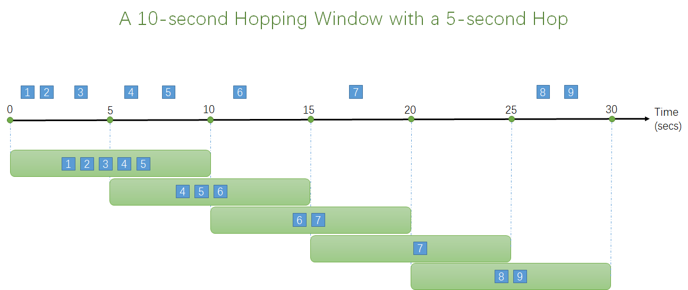
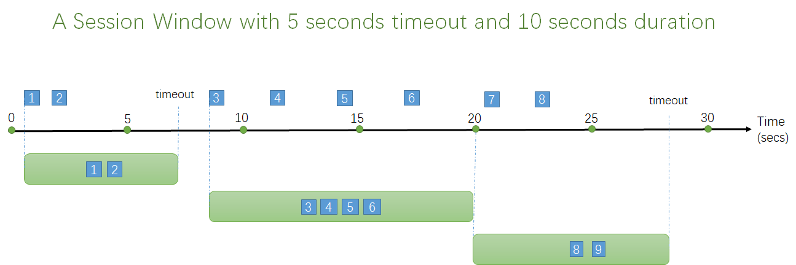

# Windows

In time-streaming scenarios, performing operations on the data contained in temporal windows is a common pattern. XStream has native support for windowing functions, enabling you to author complex stream processing jobs with minimal effort.

There are four kinds of windows to use: [Tumbling window](#TUMBLING WINDOW), [Hopping window](#Hopping window), [Sliding window](#Sliding window), and [Session window](#Session window). You use the window functions in the GROUP BY clause of the query syntax in your XStream queries. 

All the windowing operations output results at the end of the window. The output of the window will be single event based on the aggregate function used. 

## Time-units

There are 5 time-units can be used in the windows. For example, ``TUMBLINGWINDOW(ss, 10)``, which means group the data with tumbling with with 10  seconds interval.

**DD**: day unit

**HH**: hour unit

**MI**: minute unit

**SS**: second unit

**MS**: milli-second unit

## Tumbling window

Tumbling window functions are used to segment a data stream into distinct time segments and perform a function against them, such as the example below. The key differentiators of a Tumbling window are that they repeat, do not overlap, and an event cannot belong to more than one tumbling window.


TODO: 

- TIMESTAMP BY is required?
- Count function is not supported.21


```sql
SELECT count(*) FROM demo GROUP BY ID, TUMBLINGWINDOW(ss, 10);
```

## Hopping window

Hopping window functions hop forward in time by a fixed period. It may be easy to think of them as Tumbling windows that can overlap, so events can belong to more than one Hopping window result set. To make a Hopping window the same as a Tumbling window, specify the hop size to be the same as the window size.



TODO: 

- TIMESTAMP BY is required?
- Count function is not supported.


```sql
SELECT count(*) FROM demo GROUP BY ID, HOPPINGWINDOW(ss, 10, 5);
```


## Sliding window

Sliding window functions, unlike Tumbling or Hopping windows, produce an output **ONLY** when an event occurs. Every window will have at least one event and the window continuously moves forward by an € (epsilon). Like hopping windows, events can belong to more than one sliding window.


TODO: 

- TIMESTAMP BY is required?
- Count function is not supported.

```sql
SELECT count(*) FROM demo GROUP BY ID, SLIDINGWINDOW(mm, 1);
```


## Session window

Session window functions group events that arrive at similar times, filtering out periods of time where there is no data. It has two main parameters: timeout and maximum duration.



TODO: 

- TIMESTAMP BY is required?
- Count function is not supported.


```sql
SELECT count(*) FROM demo GROUP BY ID, SESSIONWINDOW(mm, 2, 1);
```


A session window begins when the first event occurs. If another event occurs within the specified timeout from the last ingested event, then the window extends to include the new event. Otherwise if no events occur within the timeout, then the window is closed at the timeout.

If events keep occurring within the specified timeout, the session window will keep extending until maximum duration is reached. The maximum duration checking intervals are set to be the same size as the specified max duration. For example, if the max duration is 10, then the checks on if the window exceed maximum duration will happen at t = 0, 10, 20, 30, etc.